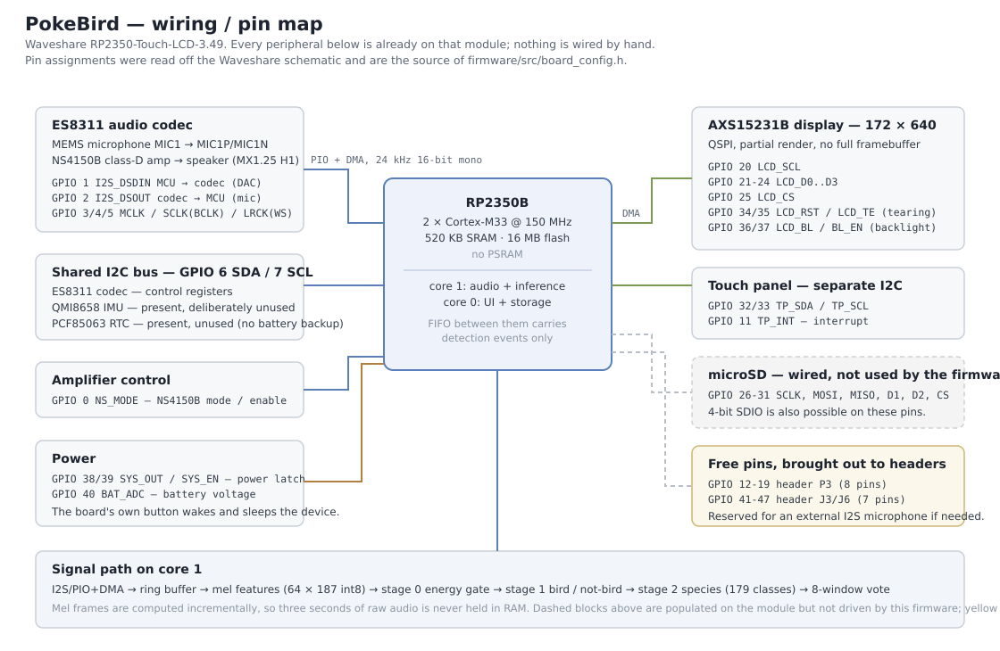

# PCB

**There is no custom PCB in this project, and that is a design decision rather
than an omission.**

PokeBird runs on a stock [Waveshare
RP2350-Touch-LCD-3.49](https://www.waveshare.com/wiki/RP2350-Touch-LCD-3.49)
module. Everything the project needs is already populated on that board: the
RP2350B, the ES8311 codec, the analogue MEMS microphone, the class-D speaker
amplifier, the 172 × 640 QSPI display with its touch panel, the microSD slot,
the battery charger and the power latch. Nothing is soldered, wired or added by
hand — a fresh board plus the `.uf2` from the release is the whole build.

Choosing an existing module was the point: the risky, expensive part of this
project was never the copper, it was fitting a two-stage neural network and a
mel front end into 520 KB of SRAM. Designing a board to hold parts that already
sit together on a $30 module would have added months and removed nothing.

## What is here instead

[`wiring-diagram.svg`](wiring-diagram.svg) — the pin map: which GPIO carries
which signal, which peripherals share the I2C bus, which are populated but left
undriven, and which pins are free. Every assignment was read off the Waveshare
schematic and verified against the board, and this diagram is the source of
[`firmware/src/board_config.h`](../firmware/src/board_config.h), which is the
single place those numbers appear in the code.

## The manufacturer's own sources

The schematic and the module's reference material live with Waveshare rather
than in this repository, because they are theirs and they change them:

- Schematic PDF and dimensions: <https://www.waveshare.com/wiki/RP2350-Touch-LCD-3.49>
- Vendor driver examples this project drew on:
  <https://github.com/waveshareteam/RP2350-Touch-LCD-3.5>

## If you wanted to make a board

The only part worth respinning is the microphone. The on-board MEMS microphone
sits on the same board as a switching supply and a QSPI display, and the
measured noise floor reflects that. Pins 12–19 are free on header P3, which is
enough for an external I2S MEMS microphone (INMP441 / ICS-43434) on a small
carrier — that is the one change that would improve field results, and the
firmware's I2S path already speaks the right protocol.
